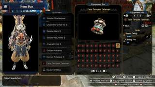

 

# Utsushi's Charm

> Whenever I look at Utsushi I feel like I can do anything. Unfortunately, when I need to register my charms, I can't lose myself in Utsushi's charm.
> Fortunately, now, with Utsushi's charm, I can lose myself in Utsushi's charm for longer.
>
> \- Utsushi Fan Girl, probably

This repo contains code that will allow you to extract all of your charms in Monster Hunter Rise from recordings taking with the switch's "save clip" feature.

It's called Utsushi's charm because I thought it would be funny to make a complementary "Utsushi's Armor Search System", but [this armor set searcher](https://mhrise.wiki-db.com/sim/?hl=en) exists. I might still try to port Athena's ASS for MHW to MHR, but for now this works for me.

# Patch Notes (Updated July 8th 2022)
- 1.7.1
  - The updater now displays information from the latest update
  - Fixed the download of new app language files not present in the executable, but present online.
- 1.7 (July 8th 2022)
  - Added level 4 slot support (#35)
  - Fixed restarting the app after setting a different game language (#34)
  - You can now ignore an update
  - You can now add invalid skills (or skills that are not in the list, don't come to me if the builder doesn't work)
  - You can record in windowed mode (See next point)
  - You can now let the app remove black bars from videos
    - It is experimental. You should fix your recordings first if it doesn't work
    - Black bars can be caused by not setting your TV size to 100% in the switch settings.
 
The rest of the patch notes can be found [here](PATCHNOTES.md)

# Usage

## Requirements
- A computer (Windows)
  - Linux and Mac might work too, you won’t be able to run the EXE and will have to run from source in a terminal window. Refer to [Running from source](#Running-from-source)
    - A build for Arch Linux is provided, since it's pyinstaller it *should* work everywhere, but lets get real, it probably wont
    - ~~A MacOS build is also provided for 1.6.0, but it's built on a hackintosh VM so you should assume it doesn't work and run from source.~~
- A USB cable to connect your switch to transfer files
  - Alternatively use a capture card and record the screen. View the [FAQ](#faq) for Genki Shadowcast information
- [The latest version of Utsushi's Charm](https://github.com/chpoit/utsushis-charm/releases/latest) downloaded to your computer (Utsushis-Charm_**vx_x**.zip)
  - You only need the executable. The inputs folder is only there for faster setup (Put the videos in there)
- Being able to read

## Steps

0. Unequip all jewels. You will create "fake" charms otherwise.
   - Item Box -> Manage Equipment -> Set Decorations -> Equipment Box -> Remove all (Press '-' on controller)
   - Don't ask, this is way out of scope for something that takes you 30 seconds to do.
   - It wont break your loadouts, if you re-equip them, they will be put back in.
1. Download the release bundle and follow the [Requirements](##Requirements) section  (Utsushis-Charm_**vx_x**.zip) (You should have done this already)
2. Record clips similar to the following of you going through your charms. Try placing the UI in front of something that is very "flat" in color and doesn't have NPCs walking in front.
   - I can easily go through 2-3 pages of charms in 30 seconds.
   - Use a stopwatch on your phone if you have trouble timing the 30 seconds. I saved a clip every ~25 seconds.
   - Don't worry about passing over a charm multiple times. Duplicates will be removed at the end.

3. Transfer the clips to your computer.
4. Put the files in the `inputs` directory. If it does not exist, create it at the same place you can find `utsushis-charm.exe`.
   - It does not matter how many you have
   - The `inputs` directory can be changed by clicking the button
   - I haven't tried to see what would happen if there are clips that are not of the charm UI
   - 
5. Run the `utsushis-charm.exe` (Double-click)
   - The app will start
   - Wait a little bit, it needs to extract some data (~5-15s)
6. Enter the options you want relative to where your files are and the game language
7. The program will run and do the following:
   1. Find all unique frames
   2. Extract Charms
   3. Apply known automatic fixes to the charms
8. If there were errors in parsing, a new window will open
   - Follow the instructions on screen and correct any invalid skill names.
   - If a skill/charm has to be corrected, a window will open and request your input.
     - Pressing cancel skips the charm and moves to the next.
     - Pressing empty removes the skill. 
     - Only valid skill names can be entered. Case Insensitive.
9.  The program is done running. 
   - Normally, charms are automatically saved to the files listed in the console
   - You can directly copy the charms to your clipboard by clicking the button.
11. Extra:
    - Sometimes tesseract is absolutely unable to read text, those charms will be logged in `app.log` and you can add them manually.
    - You can see a list of duplicate charms (if they exist) in the `charms.duplicate.txt`
    - If no charm errored, or you don't care about those charms, you should be able to open the `charms.encoded.txt` file and copy the contents into the import box of [MHR-Wiki](https://mhrise.wiki-db.com/sim/?hl=en)

## Supported Game language:
- Confirmed: 
  - English
  - French
- Theoretical:
  - Italian
  - German
  - Spanish
  - Russian
  - Polish
  - Korean
- Plenty of parsing issues (Resolution based)
  - Japanese
  - Traditional Chinese #37
  - Simplified Chinese #37
  
## Supported App Language:
- English
- French

Looking for people who can submit translations. Use [this file](data/translations/eng.json) and replace the messages appropriately if you are interested in contributing. Create a pull request to show up as a contributor within Github. I can add you in this readme if you only want to create an issue with the translations.

I am currently working on a translation to French.

Having translations for the instructions for other languages might be useful, but it will require lots of maintenance. 

# FAQ
- Q: Can I use a capture card instead?
  - I tested recording in 720p and 1080p with OBS using a Genki Shadowcast and everything worked. (MKV, others should work too)
    - Make sure you properly set the resolution of the Shadowcast at or above 720p. The default appears to be 360/480p. [Example found here](https://github.com/chpoit/utsushis-charm/issues/20#issuecomment-852183555)
  - I recommend recording in 30 fps to avoid increasing the frames to process
    - 60 fps is fine, half of the frames are skipped.
  - I see no reason other capture cards should not work
  - 1080p adds extra processing due to a downscaling step to 720p (20-30% slower)
  - I also tested using an Mclassic without any issues.
- Q: I record with a capture card but there are black bars
  - 99% of the time this will be caused by not having the screen size set to 100% in the switch settings
  - In the remaining cases, you should check your recorder settings.
  - You can try using the "Remove black bars" feature.
- Q: Does this Work for the PC version
  - Yes. As long as your resolution is 720p or above, and has a 16:9 ratio, it should
    - Basically, 1080p, 1440p, 4k and above should work without issues, albeit, the higher the resolution, the slower.
- Q: I'm trying to enter a skill in the Skill Correction thing and it doesn't work
  - This might be because the PC version has a different name for the skill, add it to the corrections.lang.csv file, or tell me to do it.
    - An example of this would be `Quick Sheath`, which is named `Quick Sheathe` on PC
    - Make sure you give me both versions of the skill name if you think the PC version messed up again.
- Q: Can I record in windowed mode
  - Yes. 
  - Yes, but if you have the "top bar" in your recording you will need the "Remove Black Bars" feature. You should try not recording the full window and only the game.

# Notes
- Version 1.5 is the last version that will officially support console mode, I may fix it from time to time if I need it for dev reasons, but I don't want to maintain a secondary workflow that will likely be used by nobody.

# Known issues
- Automatic skill corrections don't get updated in "UI" mode. 

# Troubleshooting

If the program starts and closes without anything happening, open the `app.log` file and use this section to try and fix your issues.

## Simple issues:
- 0 charms found
  - Make sure your clips are in the inputs folder
- I had to enter skill by hand but it won’t accept it
  - You need to enter them one word at a time, it might only not know what one of the words is.
  - Make sure you are writing it exactly how it is shown on the picture that pops up
- I get through the first phase, but it stops when checking the first frame of
  - This is an issue with Tesseract not being installed. Check the next bullet point.
- Google Tesseract is not installed/not found
  - This should not happen in version 1.4 and above. 
  - Make sure you installed it. You might have to reboot
  - Try adding it manually to the path
    - Potential Locations:
      -  `C:\Program Files\Tesseract-OCR` (Most likely, if you chose "Install for anyone")
      -  `C:\Users\<USERNAME>\AppData\Local\Tesseract-OCR` (If you chose "Install only for me")
      -  `C:\Program Files (x86)\Tesseract-OCR` (Version 4, less likely, would happen if you manually downloaded a 32bit installer)
  -  It seems really random whether it'll add it to path. If there is a request for it, I might add a "brute force" method to find the exe so people don't have to worry about this.
- Any other issue:
  - Consider creating a bug report [here](https://github.com/chpoit/utsushis-charm/issues/new)

## Adding something to the path (Windows)

1. Copy the path to the executable (Where the program was installed)
   - Don't put the executable file in the path, only where it is located
2. type `env` in the Windows search bar
   - Alternatively type `Edit environment variables for your account`
3. Press Enter
4. Click on `Environment Variables`
5. In `User Variables`, select `Path`
6. Click `Edit`
7. Click `New`
8. Paste the path you copied previously in the new spot.
9. Click `Ok/Apply` for every window you opened.
10. Restart every terminal/command line, or reboot to make sure you'll have access to the new commands

# How does this work

Using a combination of coding and algorithms, the developer was able to make drones fly without them crashing into each other.

In all seriousness, the work is done in a few broad steps:
1. Take all the videos and apply a filter and crop them to a smaller resolution to keep only the important data, keeping around one frame per charm
2. Out of those frames, get the slots, skills and skill levels
3. Feed the Skills to Google Tesseract to extract the names
   - If it is not a known skill, try using known corrections to get the proper skill
   - If needed, ask the user for input on what the skill is
4. Output the final list of charms

# Contribute

- If you ran everything and had to correct some skills, you probably have new corrections in your `Appdata/Local/utsushis-charm/skill_corrections.LANG.csv` or `~/utsushis-charm/skill_corrections.LANG.csv` file, consider creating a pull request to add them for others.
- If you feel like contributing anything, go ahead and submit a pull request I'll be happy to take a look and decide if it's something worth adding.
- Please use the default settings of `black` to format the python source code.

# TODOS:
- [ ] Implement a "monkey brain" way to identify kanji where I will have pictures of all skills and do a similarity check on all of them if the language is Japanese or Chinese, and possibly Korean, but Korean may be omitted since the characters are simpler.
- [ ] Add an "Eager" mode where only a fraction of the frames are kept (should try to calculate the min frames to change to a charm and double or 1.5 times it)
- [ ] ~~Maybe finish the "charm value calculator #23" (The more I worked on it the less I find it useful)~~ I Will not be working on it anymore for the [reasons explained here](https://old.reddit.com/r/MonsterHunterMeta/comments/vs2tle/sunbreakrise_easily_extract_all_your_charms/ifpec3o/)
- [ ] Maybe add a "This charm isn'T actully empty" thing. Some of my Special Ammo Boost lvl2s are just invisible (might be related to something else)
- [ ] Improve the skill corrections UI/behavior
- [ ] Make the code not a mess
- [ ] Follow https://github.com/pyinstaller/pyinstaller/issues/6889 to find when I can update opencv-python
- [ ] ~~Multithreading for some of that SPEEEEED~~
  - Unfortunately, the joblib 'loky' backend wont work with frozen executables, and the other backends offer no noticeable gain in performance. This is getting shelved until a potential rewrite under a "faster" rewrite. Current execution time is 4-8 minutes so it's really not too bad.

# Building the executable
- Requirements:
  - 7zip in path
  - A virtual env called "env" in this project (I used the `virtualenv` module)
  - Have all the contents of `requirements.txt` installed in said env
- Make sure you are not "currently" in the env (otherwise files do weird things)
- Run the `scripts\build_release.bat` file.

Sometimes windows will lock some files for a while and there is nothing you can do about it other than wait.

# Running from source
Common requirements:
- Python3 installed and in path
- Set up a virtual environment (optional)
- Install pip packages (in virtualenv if you use it.)

Normal instructions apply once the application starts.

## MacOS
- Requirements:
  - have python3 and tesseract installed via brew (or some other way)
  - Virtual env on mac (optional):  `virtualenv -p python3 env`
- Running:
  - Switch to the virtualenv `source env/bin/activate` (run at the root of the repository)
  - Set TESSDATA_PREFIX: `export TESSDATA_PREFIX=/usr/local/Cellar/tesseract/<version>/share/tessdata`
  - Install the project dependencies: `pip3 install .`
  - Run with `python3 main.py`

## Linux
- Requirements
  - You will need to install Google tesseract with your package manager of choice. Probably found under `tesseract-ocr`
  - TkInter must be installed, probably found under `python3-tk`
- Running
  - `python3 main.py`

## Windows
- Requirements
  - **Google Tesseract** installed and in path
    - A copy of the version 5.0.1 is bundled with the release. Just run it, no extra packages needed
      - You can download the installer here version here: [Installer here](https://digi.bib.uni-mannheim.de/tesseract/tesseract-ocr-w64-setup-v5.0.1.20220118.exe)
      - [A list of versions is made available by UB Mannheim here](https://digi.bib.uni-mannheim.de/tesseract/) make sure you use the "w64" version, unless you're a weirdo who is still on a 32bit system.
    - Make sure it's in path
  - Python3 installed and in path  
  - CPP Build tools https://visualstudio.microsoft.com/visual-cpp-build-tools/
    - Check the C++ box when it asks you ([Check this stackoverflow answer for the exact thing to install](https://stackoverflow.com/a/64262038)
    - You might be able to only install https://aka.ms/vs/17/release/vc_redist.x64.exe
- Running:
  - `./env/Scripts/activate` (if you use a virtual env)
  - `python main.py`

# Extra command-line options
If you run from source, or call the executable from the terminal you can make use of the following flags/arguments to achieve different functionality.

- `-h` or ` --help`: Shows arguments
- `--thirdparty`: Shows 3rd party licenses
- `--console`: Runs the app in "console" mode
- `--autoexit`: Skips the "Press enter to exit" prompt in console mode
- `--skip-frames`: Skips the first frame extraction step. Useful if the second step crashed.
- ` --skip-charms`:`Skips the Tesseract-OCR step. Not sure why you would want that.
- `-i <INPUT_DIR>` or `--input <INPUT_DIR>`: Changes the Input directory for videos
- `-f <FRAME_DIR>` or `--frames <FRAME_DIR>`: Changes the Directory used to store temporary frames
- `-c <FILE_NAME>` or `--charm-json <FILE_NAME>`: Changes the name of the json formatted charms
- `-e <FILE_NAME>` or `--charm-encoded <FILE_NAME>`: Changes the name of the MHR-Wiki formatted charms
- `-l <LANG_NAME>` or `--language <LANG_NAME>`: Changes the default language for the recordings. Use the list in [Supported languages](#supported-game-language) to know what to enter. It only works for the first launch, data in the config file takes priority.
- `-a <LANG_NAME>` or `--app-language <LANG_NAME>`: Changes the language of the app. Use the list in [Supported languages](#supported-game-language) to know what to enter. It only works for the first launch, data in the config file takes priority.
- `--reset`: Resets data in the config. Currently forces the language to be overwritten in config with `-a` and `-l` arguments.
- `-t <TESSERACT_DIRECTORY>` or `--tesseract <TESSERACT_DIRECTORY>`: When you want to pass a custom tesseract location. It is saved to the config. Pass either the dll or .so.X file, or the directory containing it.

# Included data

## mh-rise skills language - Feuille 1.csv 
The file located in [data\/mh-rise skills language - Feuille 1.csv](./data/mh-rise%20skills%20language%20-%20Feuille%201.csv) is a slightly modified version of the file found [here](https://docs.google.com/spreadsheets/d/1ce4_R7HvBPPYE63qyGfeI-nTTSBDsGCGc7ETTGHqYac/edit#gid=0). It is provided in the repository to aid in the rebuild of skill files for those interested.

I added the new Sunbreak skills, but currently only english versions are available.