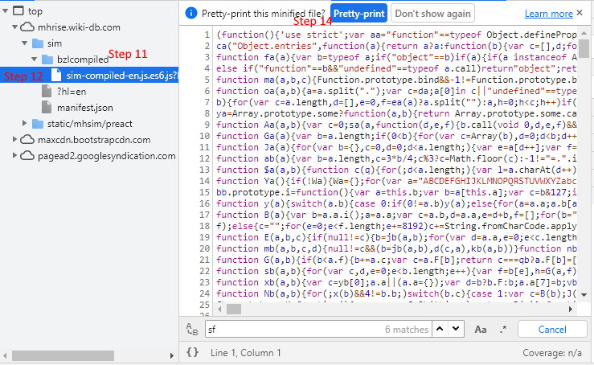
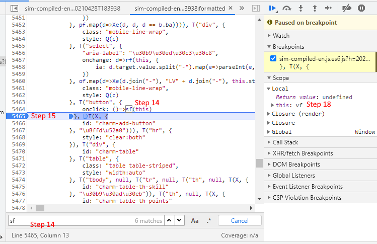
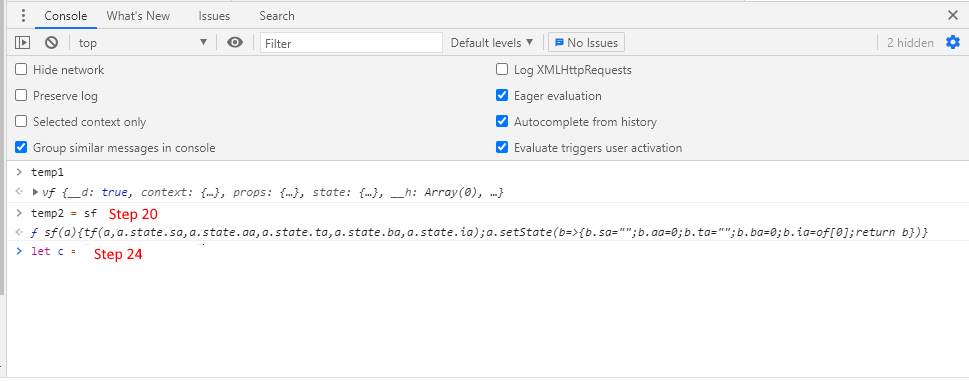

# Utsushi's charm

This repo contains code that will allow you to extract all of your charms in Monster Hunter Rise from recordings taking with the switch's "save clip" feature.

It's called Utsushi's charm because I thought it would be funny to make a complementary "Utsushi's Armor Search System", but ["this armor set searcher exists"](https://mhrise.wiki-db.com/sim/?hl=en). I might still try to port Athena's ASS for MHW to MHR, but for now this works for me.

# Usage

## Requirements
- A computer (Windows) 
  - Linux and Mac might work too
- A usb cable to connect your switch to transfer files
- **ffmpeg** installed and in path
  - Use the latest version you can find
  - [I got this version](https://www.gyan.dev/ffmpeg/builds/ffmpeg-release-full.7z)
  - You will also need 7zip to unpack it. You should already be using 7zip, it's better than winrar
- **Google Tesseract** installed and in path
  - I used version 3 because I didn't feel like rebooting under Linux.
  - [I got it here](https://sourceforge.net/projects/tesseract-ocr-alt/files/tesseract-ocr-setup-3.02.02.exe/download)
  - Should add itself to path, you might have to reboot.
    - Should be in `%Appdata%/Local/Tesseract-OCR` otherwise.
- **Python 3** (in path)
  - I used 3.9, but most above 3 should word
  - [Here](https://www.python.org/downloads/)
  - Check the box to add to path
- This repository downloaded to your computer
  - Installing everything in the requirements.txt with `pip install -r requirements.txt`. You might have to use `pip3` instead of `pip`
- Some knowledge of how to type things in the terminal
- Being able to read
- The understanding that this might take you longer to setup than it would have taken you to enter the dozen charms you like.

### Adding something to the path (Windows)

1. Copy the path to the executable, for example **ffmpeg** would likely be `C:\Users\"YOU"\Downloads\ffmpeg-4.4-full_build\bin`
   - Don't put the exe file in the path 
2. type `env` in the windows serch bar
   - Alternatively type `Edit environment variables for your account`
3. Press Enter
4. Click on `Environment Variables`
5. In `User Variables`, select `Path`
6. Click `Edit`
7. Click `New`
8. Paste the path you copied previously in the new spot.
9. Click `Ok/Apply` for every window you opened.
10. Restart every terminal/command line, or reboot to make sure you'll have access to the new commands

## Steps

0. Unequip all jewels. You will create "fake" charms otherwise.
   - Don't ask, this is way out of scope for something that takes you 30 seconds to do.
1. Record clips similar to the following of you going through your charms. Try placing the UI in front of something that is very "flat" in color and doesn't have NPCs walking in front. 
   - I can easily go through 2-3 pages of charms in 30 seconds. 
   - Use a stopwatch on your phone if you have trouble timing the 30 seconds. I saved a clip every ~25 seconds
   - Don't worry about passing over a charm multiple times. Duplicates will be removed at the end.

2. Transfer the clips to your computer.
3. Put the files in the "inputs" directory in this repository.
   - It does not matter how many you have 
   - I haven't tried to see what would happen if there are clips that are not of the charm UI
3. Open a terminal/command line in the same directory as the "main.py" file.
4. type `python main.py` and press Enter. You might have to run `python3 main.py`
5. The first 2 steps of the program do no require any attention
   - They can take a while
6. The third step might ask for your input, depending on how well the image recognition works.
   - Follow the instructions on screen and correct any invalid skill names.
   - If a skill has to be corrected, a window with the skill should open, you might have to alt-tab to it, windows likes to hide it.
   - Sometimes tesseract is absolutely unable to read text, those charms will be logged in [`app.log`](app.log) and you can add them manually.
7. Congrats, you now have a json file with all (or almost all) of your charms. You can stop there and do litterally nothing with it until I find a solution to the problem, or you can have fun exploring the Google Chrome debugger with me

8. Congrats, you've decided to soldier on. Open Google Chrome and go to the charms tab of the ["armor search wiki"](https://mhrise.wiki-db.com/sim/?hl=en) 
9.  Press `F12` or `CTRL+SHIFT+I` to open the dev console.
10. Click on the `Sources` tab
11. Click on the Arrow thing next to the `bzlcompiled` folder
12. Click on the `sim-compiled-whatever` file
13. Click on `Prett-print` You can use the following screenshot for help:

14. In the search bar type `sf` and press enter until you see line `5464`, or what is in the next screenshot

15. Click on `5465`. A blue marker should appear on `5465`
16. On the actual website, click on the "Add" button to add a charm
17. You should "hit" the breakpoint and content should appear in the `Scope` section of the sources tab
18. Right click on `>this :vf` and click on `Store object as global variable`
19. A console should open at the bottom of the sources tab.

20. In that console, type `temp2 = sf` and press Enter.
21. Click on `5465`. The blue marker should disappear.
22. Press `F8`
23. Open the `charms.json` file in a text editor  and copy the contents
    - Notepad works
24. in the Console opened in step 18/19, type `let c= `, paste the contents of the `charms.json` file and press Enter.
25. *Optional* Delete all the charms you have on the website
26. Open the `crappy_js_import.js` file in a text editor  and copy the contents
27. Paste the contents in the console and press Enter. 
28. Congrats, you're done, export your charms and save them somewhere
    

# How does this work

Using a combination of coding and algorithms, the developer was able to make drones fly without them crashing into each other. 

In all seriousness, the work is done in a couple broad steps:
1. Masking and cropping the videos to keep only important sections
2. Using OpenCV, I use the charm window to find "new" charms being hovered over and keep only one image per charm
3. Using OpenCV once again, I apply filters to clean up the images, identify slots and skill levels and extract a smaller image that has the skill name
4. The skill name image is passed to Google Tesseract that struggles to identify what is written
5. Based on a list of corrections, simple spellchecking and potential user inputs, a charm is rebuilt

# Contribute

- If you ran everything and got new corrections in the [`skill_corrections.csv`](skill_corrections.csv) file, consider creating a pull request to add them for others.
- If you feel like contributing anything, go ahead and submit a pull request I'll be happy to take a look and decide if it's something worth adding. 

# TODOS: 
- Figure out what kind of demonic ritual I have to do to encode charms in the same way as the website.
  - The JS solution works, but it's a pain in the ass for people that don't know how the debugger works.
  - I really don't want to reverse engineer what appers to be a minified react app.
- Throw out FFMPEG if OpenCV can do the masking/cropping faster, it would allow for one fewer dependency
- Throw out Google Tesseract/Try newer version
  - Version 3 has trouble with quite a few words (Slugger, Recovery, Earplugs, Counterstrike, Maestro, etc)
  - Newer versions might not
  - I'm seriously considering going full monkey brain and having one "mask" per skill like I'm doing for the slots and skill levels.
  - The monkey brain approach would probably make it so this can be ran completely unattended, at the cost of some extra storage space.
- Solution for people that don't want to bother with the hassle
- Make the code not a mess
